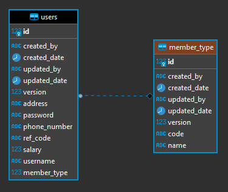

# Register & Authentication Service 

Spring Boot + JWT + Mockito
## Content
- [Design](#Design)  
  - [Diagram](#ER-Diagram)
  - [Api Design](#Api-Design)
    - [Authentication](#API-Authentication)
    - [Registration](#API-Registration)
    - [Greetion](#API-Greetion)
- [Installation](#Installation)
- [Usage](#Usage) 

## Design
### Structure Database (ER Diagram)


## API Design
### API Description
|  API Name| API URL  | HTTP Method |
|---|---|---|
|  [Registration](#API-Registeration) | http://localhost:8008/api/register    | POST |
|  [Authentication](#API-Authentication)| http://localhost:8008/api/authenticate | POST |
|  [Greetion](#API-Greetion) | http://localhost:8008/api/greeting | GET |

### API Registration
**HTTP Method** : POST

**URL** : http://localhost:8008/api/register

Request Model
|  Field Name | Data Type  | Length | Not Null |
|---|---|---|---|
| username  | string    | 255| Y |
| password | string | 255 | Y |
| salary| double | | Y |
| phoneNumber | string | 10 | Y |
| address| string | 1000 | N | 

JSON Request
```json
{
    "username":"test",
    "password":"P@ssw0rd",
    "phoneNumber":"0999999999",
    "salary": 0.00 ,
    "address":"test address"
}
```
Response Model

## Installation
### Database

1. Install [Docker](https://www.docker.com/products/docker-desktop) 

2. Install [SQLServer on Docker](https://octopus.com/blog/running-sql-server-developer-install-with-docker)

3. Connect to database with [Microsoft SQL Server Management Studio 18](https://docs.microsoft.com/en-us/sql/ssms/download-sql-server-management-studio-ssms?view=sql-server-ver15) and create new database name is "javabackendtest"

### Java
1. Download & Install [Java 1.8](https://www.oracle.com/java/technologies/javase/javase-jdk8-downloads.html)


## Usage
### Run with IDE (Intellij)
 Open project on IDE with Maven and Run project with Spring Boot
### API 
#### Register (POST)


```bash
#URL
http://localhost:8008/register

#JSON Request
{
    "username":string(255),
    "password":string(255),
    "phoneNumber":string(10),
    "salary": 0.00 ,
    "address":string(1000)
}

#JSON Response (Success)
{
    "success": {
        "code": "201",
        "data": {
            "userInfo": {
                "address": string(1000),
                "id": bigint,
                "memberType": string(255),
                "phone": string(10),
                "refCode": YYYYMMDD + Last 4 Digit phone,
                "salary": double,
                "username": string(255)
            }
        },
        "message": "Registered Successfully"
    }
}

#JSON Response (Error)
{
    "error": {
        "code": Http Status Code,
        "message": Error details
    }
}

```
#### Authentication (POST)


```bash
#URL
http://localhost:8008/authenticate

#JSON Request
{
    "username":string(255),
    "password":string(255)
}

#JSON Response (Success)
{
    "success": {
        "code": "200",
        "data": {
            "userInfo": {
                "address": string(1000),
                "id": bigint,
                "memberType": string(255),
                "phone": string(10),
                "refCode": YYYYMMDD + Last 4 Digit phone,
                "salary": double,
                "username": string(255)
            },
            "token": Access Token
        },
        "message": "Authenticated"
    }
}

#JSON Response (Error)
{
    "error": {
        "code": Http Status Code,
        "message": Error details
    }
}

```
#### Verify (GET)


```bash
#URL
http://localhost:8008/greeting

#Request Headers
Authorization : Bearer 'Token'

#Response (Success)
Welcome 'username' :D

```
